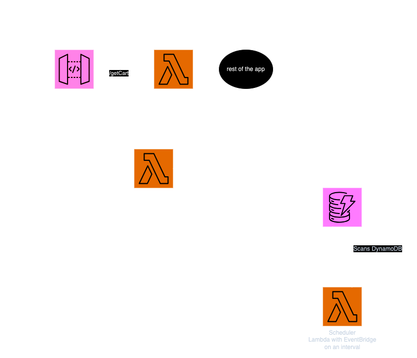

# AWS API Gateway Automated API Key Rotation
Small proof of concept to show how API Gateway API Keys can be auto rotated.

## Disclaimer
- This is a POC repo. Authentication only with an API KEY is an anti-pattern and not safe.
- The Lambda role in index.ts is wide open, allows specific actions on all the APIGWs and Lambdas and DynamoDB tables. You must scope it down before production.
- Scanning all the items in a NoSQL DB is also an anti-pattern and gets expensive at scale. You should select a better rotation mechanism or keep the values on another data store at scale. This POC was built so that the unique ItemID in the DB would stay the same. So it was purpose built.
- This repo gets deployed by Pulumi and uses aws-classic not aws-native.
- It is written in JS/TypeScript and uses AWS SDKv3. Lamda runtimes are NodeJS 18.
- This currently gets triggered by EventBridge on a 30 day schedule. This could be choreographed with StepFunctions as well. Another way it could be done is to write the API Keys to DynamoDB with TTLs to trigger EventBridge event with ItemExpiration and kick off rotationLambda, in that case the whole DB item Key would need to be re-created and your app needs to handle that. The POC app in my case needed it to stay the same. You could create same unique ID in the DB again, that may have implications. 

### Diagram:

### Components:
- <b>/lambda:</b>  a function which requires API key to be executed.
Test like this: curl -H "x-api-key: <keyhere>" https://<yourAPIGWsUniqueID>.execute-api.us-east-1.amazonaws.com/prod/getcart

- <b>/schedulingLambda:</b>  the function which gets triggered by EventBridge on schedule every 30 day.
Scans dynamoDB table for updateTime property of each item in the table.
Anything found older than 30 days, it pulls it's APIGWKeyID, usagePlanID and itemID from the table and triggers rotationLambda function.

- <b>/rotationLambda:</b>  the function which takes 3 variables from the schedulingLambda function and deletes the old API key, creates a new one and associates the new API key with the usageplan that's passed to it. Then updates the dynamoDB table with the given ItemID along with the updateTime.

### Setup:

- Makesure pulumi is installed via npm or brew / however you are installing packages
- Clone the repo
